# Stock Modules — Workflows

Seven modules under [src/modules/stocks/](src/modules/stocks/). One of them,
`stock-voucher`, owns the document engine; four are screens that configure it with a
rule record; two are policy/pricing side-cars.

Routes below omit the URI version segment — NestJS is configured with
`VersioningType.URI` in [main.ts:197](src/main.ts#L197), so a real path is
`/{prefix}/v1/stock/opening`.

---

## 1. Composition — who owns what

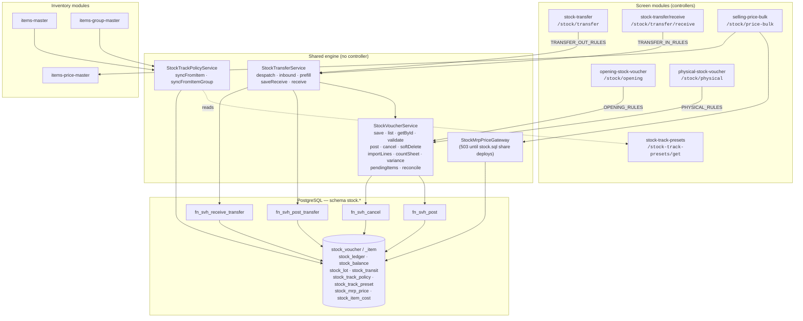

**The one idea the whole engine rests on:** the *route* pins the voucher type, never the
payload. Each controller holds a frozen `StockVoucherTypeRules` record
([stock-voucher.types.ts](src/modules/stocks/stock-voucher/types/stock-voucher.types.ts))
and hands it to the shared service on every call. The DTO rejects any `voucherType` but
its own, and even that value is discarded.

| Rule | OPENING | PHYSICAL | TRANSFER_OUT | TRANSFER_IN |
|---|---|---|---|---|
| `typeCode` | `OPN` | `PHY` | `TRF` | `TRI` |
| `quantityMode` | `QTY` | `COUNT` | `QTY` | `QTY` |
| `postFunction` | `fn_svh_post` | `fn_svh_post` | `fn_svh_post_transfer` | `fn_svh_receive_transfer` |
| `ledgerTxnTypes` | `OPENING` | `PHYSICAL_PLUS`, `PHYSICAL_MINUS` | transfer out | transfer in |
| `isInward` | true | false (both ways) | false | true |
| `allowsCount` | ✗ | ✓ | ✗ | ✗ |
| `allowsToBranch` | ✗ | ✗ | ✓ | ✗ |
| `requiresLot` | ✗ (engine resolves) | ✓ | ✓ | ✓ |
| `zeroesLineCost` | ✗ | ✓ | ✓ | ✓ |
| `allowsRepeatHolding` | ✗ (one per year) | ✓ | ✓ | ✓ |
| `defaultRateSource` | — (MANUAL) | `AVG_COST` | — | — |

---

## 2. Document lifecycle — the state machine every voucher shares

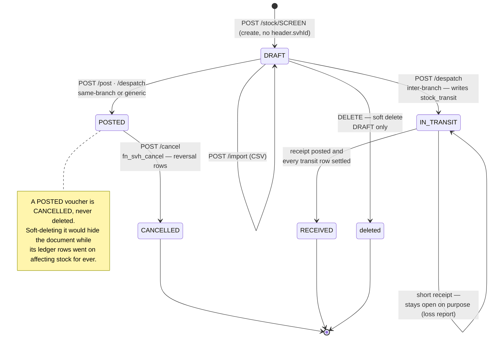

A cancellation writes **reversal rows carrying the original `doc_date` and `acc_year`**, so
an as-on-date report reads "this document never moved stock". It can legitimately fail
with 409 — reversing an opening after the stock was sold drives the holding negative and
`fn_sml_apply` refuses under `stp_allow_negative = 'BLOCK'`. The fix is an ADJUSTMENT, not
a retry.

---

## 3. Save — the shared pipeline (`StockVoucherService.save`)

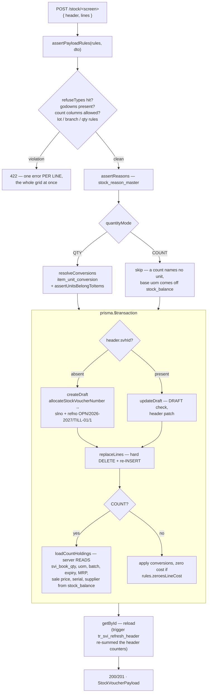

Two things the service will never let the client do: **write header totals**
(`svh_line_count`, `svh_total_qty`, `svh_total_value` are re-summed by
`tr_svi_refresh_header` and again by `fn_svh_recompute` at post — Prisma *can* write them,
which is the danger), and **merge lines by line number** (update is a full replace; merging
over a grid the user inserts into the middle of is where line numbers drift from the rows
they name).

---

## 4. Post — preflight, then one statement

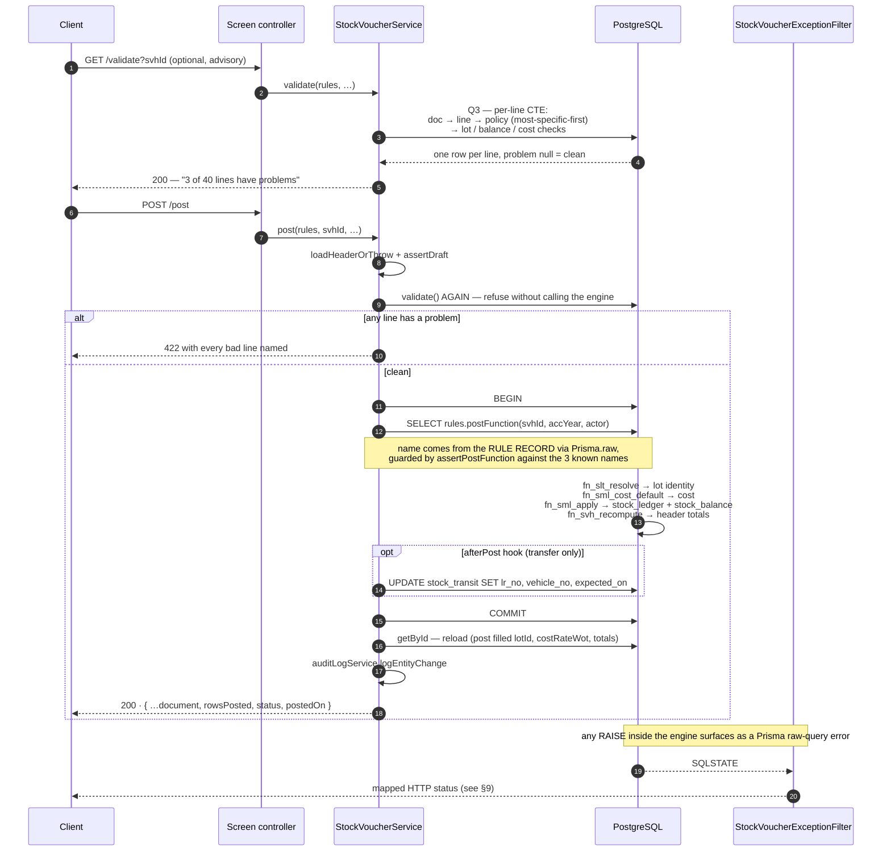

`validate` runs **twice** on purpose: once as the advisory preflight the screen calls, and
again inside `post` — because `fn_svh_post` raises on the *first* bad line and rolls the
whole document back, which is right for the database and useless as a screen message.

---

## 5. Opening stock — the go-live workflow

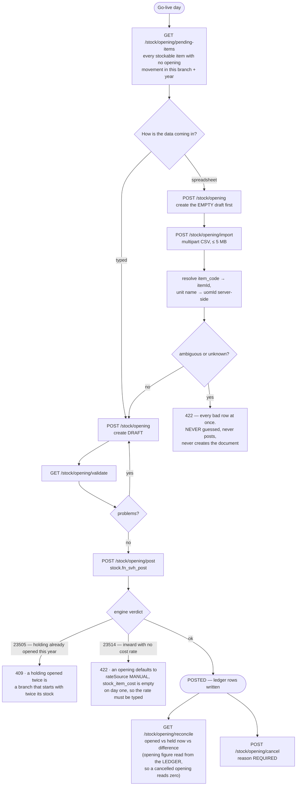

`allowsRepeatHolding` is **off**: one opening per holding per year. `requiresLot` is off
too — `fn_slt_resolve` owns lot identity here, so the service refuses a client-supplied
`lotId`; otherwise two documents could open one holding under two lots.

---

## 6. Physical stock count — the COUNT quantity mode

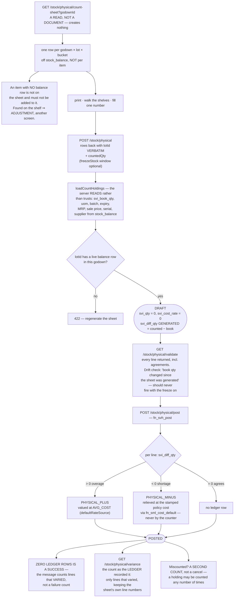

Four rules invert here relative to an opening, and each one the OPENING satisfied only by
accident: `quantityMode: 'COUNT'` (the line states what was *found*, so a
"every line must have a quantity" rule would refuse a count outright, once per line);
`defaultRateSource: AVG_COST` (MANUAL would make the engine refuse every overage line);
`allowsRepeatHolding: true`; and **two** `ledgerTxnTypes` in one document.

`DELETE /stock/physical` on a draft also **lifts the freeze** — the guard reads DRAFT
sheets, so an abandoned sheet would otherwise block the godown until `freezeTo` passed.

---

## 7. Stock transfer — one despatch endpoint, two shapes

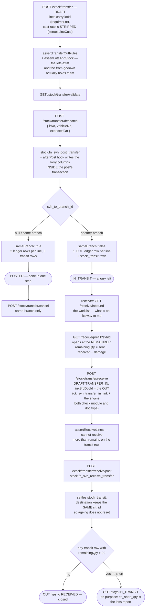

Three details worth keeping:

- **The despatch response reads `sameBranch` off the *document*, not the request** — the
  engine decided it. One endpoint, two shapes, and the screen cannot know how to finish
  until it is told.
- **`stt_lr_no` / `stt_vehicle_no` / `stt_expected_on` are written by the API**, not the
  engine, and inside the post's own transaction via the narrow `afterPost` hook. A second
  transaction could commit a despatch and then fail to record the lorry — a despatch note
  with no vehicle number, and no way to tell afterwards whether it was never sent or lost
  on the way.
- **The line's cost rate is stripped, not merely discouraged.** A nonzero `svi_cost_rate`
  makes `fn_sml_cost_default` bail (it only fills gaps) *and* the OUT insert omits the
  value columns — the row lands at that rate with **value 0**. Cost travels with the
  stock; nobody re-enters it.

---

## 8. Selling price bulk — Change Selling Price (menu 30)

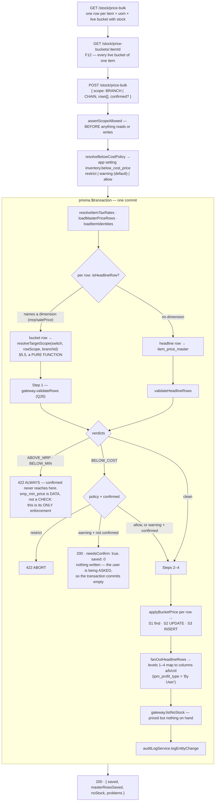

`resolveTargetScope` is the module's actual logic, and it was the legacy 3.0 form's actual
bug: **every real defect in that screen was in which row an edit landed on, not in the
arithmetic.** The header radio is not a display filter — it decides what S1 looks for, and
therefore whether S2 updates or S3 inserts.

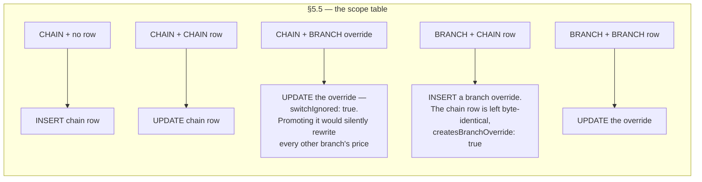

Three statements sit behind `StockMrpPriceGateway` and answer **503** until the external
`stock.sql` share is deployed. A payload of headline-only rows never touches it and saves
end to end today.

---

## 9. Track presets → track policy (no controller of its own)

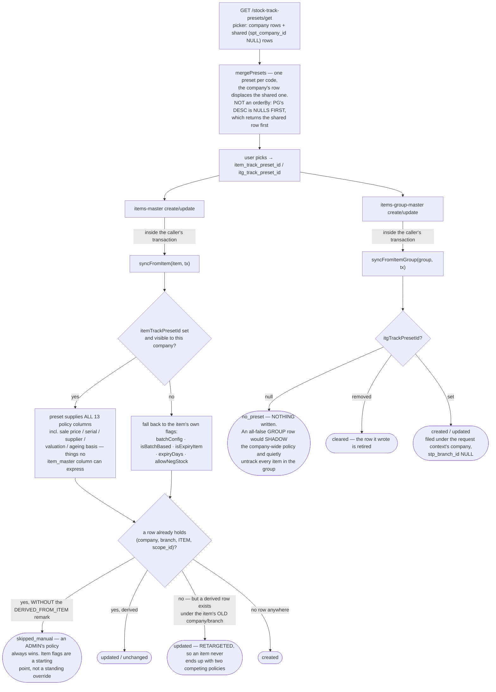

The resolver every engine query uses runs **most-specific-first**:

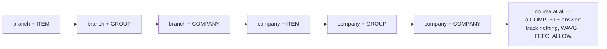

It is also resolved against the **document's** `doc_date`, not today's — see the `policy`
CTE in `validate()`.

---

## 10. Error translation

Every stock controller wears `StockVoucherExceptionFilter` (selling-price has its own,
sharing the same table). A `RAISE` inside an engine function arrives as a Prisma raw-query
error carrying a SQLSTATE; the filter turns it into an HTTP status with a sentence a
shopkeeper can read, and **lets unrecognised failures fall through to the 500 path, stack
and all** — dressing one up as a clean 4xx teaches a client to retry for ever against a bug
it cannot fix.

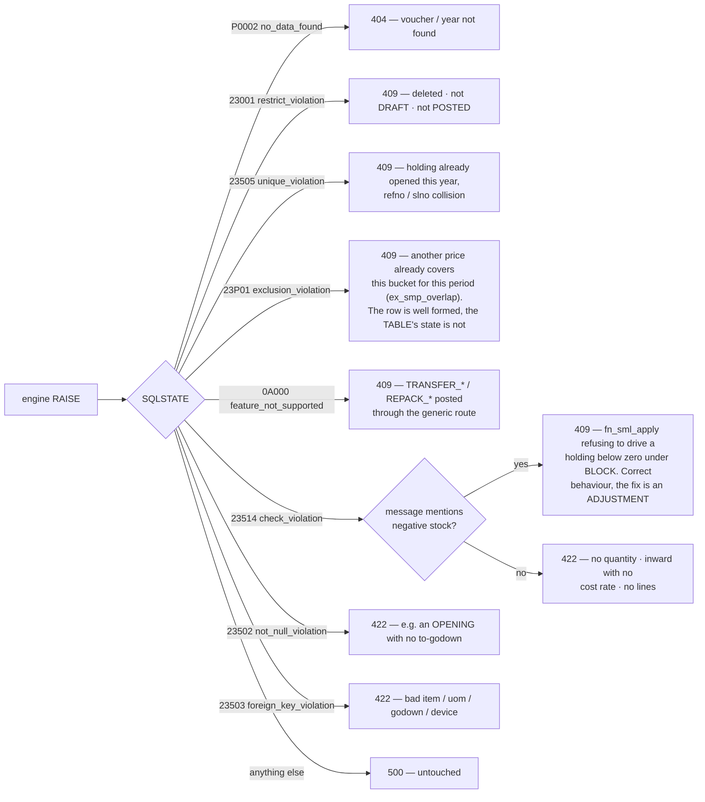

---

## 11. Caching

**No `@CacheTTL` anywhere in the voucher controllers**, deliberately. Every read is a live
balance or a live document status: a cached preflight says a holding is free to open after
another till has opened it, and a cached count sheet is a book figure from before the last
sale.

---

## Route index

| Module | Method | Path | What it does |
|---|---|---|---|
| opening | POST | `/stock/opening` | create/update DRAFT (by `header.svhId`) |
| | GET | `/stock/opening` | list, or load one when `svhId` given |
| | GET | `/stock/opening/validate` | per-line preflight (advisory) |
| | POST | `/stock/opening/post` | `fn_svh_post` |
| | POST | `/stock/opening/cancel` | reversal rows; `reason` required |
| | DELETE | `/stock/opening` | soft delete, DRAFT only |
| | POST | `/stock/opening/import` | replace a DRAFT's lines from CSV (≤5 MB) |
| | GET | `/stock/opening/pending-items` | items with no opening movement |
| | GET | `/stock/opening/reconcile` | opened vs held now vs difference |
| physical | GET | `/stock/physical/count-sheet` | generate a sheet from `stock_balance` |
| | POST | `/stock/physical` | create/update DRAFT count |
| | GET | `/stock/physical` | list / load |
| | GET | `/stock/physical/validate` | per-line preflight incl. drift check |
| | POST | `/stock/physical/post` | `fn_svh_post` — PLUS and MINUS |
| | POST | `/stock/physical/cancel` | un-corrects a correction |
| | DELETE | `/stock/physical` | soft delete; also lifts the freeze |
| | GET | `/stock/physical/variance` | the count as the ledger recorded it |
| transfer | POST | `/stock/transfer` | create/update DRAFT TRANSFER_OUT |
| | GET | `/stock/transfer` | list, or load with transit rows |
| | GET | `/stock/transfer/validate` | per-line preflight |
| | POST | `/stock/transfer/despatch` | `fn_svh_post_transfer` + lorry columns |
| | POST | `/stock/transfer/cancel` | same-branch POSTED only |
| | DELETE | `/stock/transfer` | soft delete, DRAFT only |
| receive | GET | `/stock/transfer/receive/inbound` | what is on its way to me |
| | GET | `/stock/transfer/receive/prefill` | open a receipt at the remainder |
| | POST | `/stock/transfer/receive` | create/update DRAFT TRANSFER_IN |
| | POST | `/stock/transfer/receive/post` | `fn_svh_receive_transfer` |
| | DELETE | `/stock/transfer/receive` | soft delete, DRAFT only |
| price bulk | GET | `/stock/price-bulk` | the price grid |
| | GET | `/stock/price-buckets/:itemId` | F12 — every live bucket |
| | POST | `/stock/price-bulk` | save changed rows, one transaction |
| presets | GET | `/stock-track-presets/get` | picker, company rows over shared |
| track policy | — | *(no controller)* | called by items-master / items-group-master |
